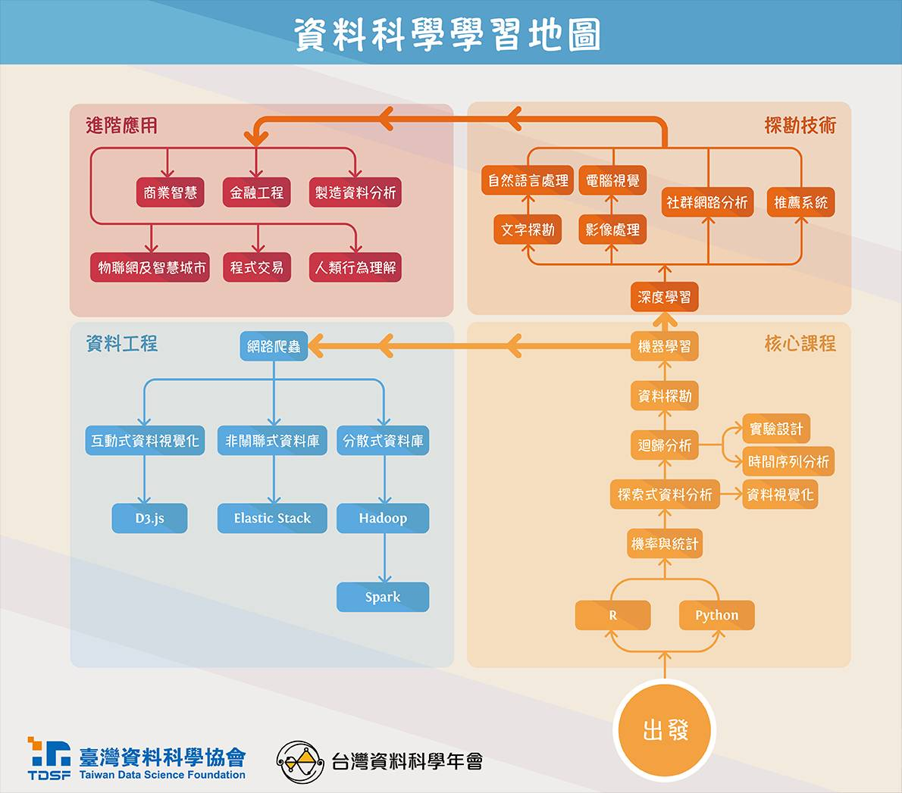

# Welcome to My Learning Note 
> 歡迎來到我演算法學習筆記! 

學演算法主要是你的思考如何解決問題的過程，程式碼不是最重要的，畢竟答案都查的到，程式碼只是實現想法的工具。當然我的程式碼也是會參考別人的，但是我在看別人的解法前，都會嘗試的自己去思考去寫，就算你的解法不是最好的，但至少你有你的想法。

# 課堂筆記
### week 1
- [github](https://github.com/aaron1aaron2/my-learning-note/blob/master/week1)

### week 2
- [linked-List](https://github.com/aaron1aaron2/my-learning-note/blob/master/week2)

### week 3
- [Stack & Queue](https://github.com/aaron1aaron2/my-learning-note/tree/master/week3)

### week 4
- [set](https://github.com/aaron1aaron2/my-learning-note/blob/master/week4/readme.md#set) 
- [Insertion Sort](https://github.com/aaron1aaron2/my-learning-note/tree/master/week4) 

### week 5
- [Quick-Sort](https://github.com/aaron1aaron2/my-learning-note/tree/master/week5)
- [HW1:實作 Quick Sort](https://github.com/aaron1aaron2/my-learning-note/blob/master/week5/Quick%20Sort.ipynb)
- [HW1: 流程圖](https://htmlpreview.github.io/?https://github.com/aaron1aaron2/my-learning-note/blob/master/week5/Quick%20Sort.html) >>>[如何預覽HTML](https://github.com/aaron1aaron2/my-learning-note/blob/master/week1/readme.md#%E5%A6%82%E4%BD%95%E5%9C%A8-github-%E4%B8%8A%E9%9D%A2%E9%A0%90%E8%A6%BD-html-%E7%9A%84%E6%AA%94%E6%A1%88)

### week 6
- [Heap Sort](https://github.com/aaron1aaron2/my-learning-note/blob/master/week6)

### week 7
- [Merge Sort](https://github.com/aaron1aaron2/my-learning-note/tree/master/week7)

### week 8
- Binary Tree

### week 9
- Binary Search Tree
- [HW2-merge_sort](https://htmlpreview.github.io/?https://github.com/aaron1aaron2/my-learning-note/blob/master/week7/Merge%20Sort.html)
- [HW2-heap_sort](https://htmlpreview.github.io/?https://github.com/aaron1aaron2/my-learning-note/blob/master/week6/Heap%20Sort.html)
### week 10
- Red Black Tree

### week 11 
- Hash Table

### week 12
- Breadth-First Search

### week 13 
- Depth-First Search

### week 14
- Minimum Spanning Tree

### week 15
- Shortest Path

### leetcode 
- [leetcode 練習筆記](https://github.com/aaron1aaron2/my-learning-note/tree/master/leet%20code)

### CS50
- [CS50 筆記](https://github.com/aaron1aaron2/my-learning-note/tree/master/CS50)
---
# About me
> 大家好我是一個天真、可愛、善良的大學生! 大家都叫我**熊**

### **何彥南** (aaron)

* 就讀於: Soochow University (東吳大學)
* 主修: 巨量資料管理學系
* 生日: 1998/11/26
* 星座: 射手座
* 興趣: 打羽球
* 綽號: 荷花、熊、187
* 擅長程式: python 

# python 學習地圖

## 資料科學
- 機率與統計 50%
- 探索式資料分析 40%  
  - 資料視覺化 50%
- 回歸分析 0% 
  - 時間序列分析 30%
  - 實驗設計 30%
- 資料探勘 30%
- 機器學習 0%

## 資料工程
- 網路爬蟲 80%
  - 互動式資料視覺化 0%
    - D3.js 0%
  - 非關聯式資料庫 0%
    - Elastic Stack 0%
  - 分散式資料庫 0%
    - Hadoop 0%
    - Spark 0%
    
## 資料探勘技術
- 深度學習 50%
  - 影像處理 30%
    - 電腦視覺 0%
  - 文字探勘 30%
    - 自然語言處理 30%
  - 社群網路分析 0%
  - 推薦系統 0%
  
## 進階應用
- 金融工程 0%
- 製造資料分析 0%
- 商業智慧 0%
- 物聯網及智慧城市 0%
- 程式交易 0%
- 人類行為理解 0%

## 網站架設
- Flack 0%
- Django 0%
- 區塊鏈分散式網路運用 0%

# 我所認識的大數據 
>以下純屬個人想法僅供參考。

在各科技的進步下，這世界上的資料呈爆炸性成長，傳統的資料分析方法已經無法駕馭龐大且多變的數據。掌握這些數據分析技術和資料操作已經成為趨勢。big data 的概念也隨之出來，而專門處理 big data 的人也被稱為 data scientist(資料科學家)，在國外被當作夢幻的職業。當然，要成為資料科學家也不是容易的事，不僅要懂得善用不同工具熟練的操縱資料，還要將所有學到的知識組織起來，依自己的想法建構模型，進而有效的達成任務。每天吸收新知識也很重要，頂尖的資料科學家一天讀個十幾篇 paper 都不在話下，但是讀 paper 對我這個英文程度不好的人真的不適合。

- 或許對我來講，真正的資料科學家真正要做的事不是我想像中的那麼有趣，但我還是會繼續走下去直到尋找自己真正想要的東西。

- 成為一名夢幻的資料科學家很酷，也是我曾經的夢想，但從來都不是我的終點。

- 我能肯定，我對資料科學還是蠻有興趣的，這也是我加入東吳巨資的初衷。大概是一種對資料熱情，我喜歡這種發現、探索資料的感覺，沒有理由的...  

### >>>希望大家也要更了解自己想要甚麼
* 基本功很重要，不要好高騖遠。
* 試著去了解資料科學家是在做甚麼。
* 要對資料科學有熱情。
* 給自己一個目標。
* 新的知識永遠學不完，要懂得取捨。
* 嘗試使用英文搜尋東西。
