```python
import pandas as pd 

df = pd.read_csv('D:\Kaggle 練習\kc-house-data\kc_house_data.csv')

```


```python
df.head()
```


<div>
<style scoped>
    .dataframe tbody tr th:only-of-type {
        vertical-align: middle;
    }

    .dataframe tbody tr th {
        vertical-align: top;
    }

    .dataframe thead th {
        text-align: right;
    }
</style>
<table border="1" class="dataframe">
  <thead>
    <tr style="text-align: right;">
      <th></th>
      <th>id</th>
      <th>date</th>
      <th>price</th>
      <th>bedrooms</th>
      <th>bathrooms</th>
      <th>sqft_living</th>
      <th>sqft_lot</th>
      <th>floors</th>
      <th>waterfront</th>
      <th>view</th>
      <th>...</th>
      <th>grade</th>
      <th>sqft_above</th>
      <th>sqft_basement</th>
      <th>yr_built</th>
      <th>yr_renovated</th>
      <th>zipcode</th>
      <th>lat</th>
      <th>long</th>
      <th>sqft_living15</th>
      <th>sqft_lot15</th>
    </tr>
  </thead>
  <tbody>
    <tr>
      <th>0</th>
      <td>7129300520</td>
      <td>20141013T000000</td>
      <td>221900.0</td>
      <td>3</td>
      <td>1.00</td>
      <td>1180</td>
      <td>5650</td>
      <td>1.0</td>
      <td>0</td>
      <td>0</td>
      <td>...</td>
      <td>7</td>
      <td>1180.0</td>
      <td>0</td>
      <td>1955</td>
      <td>0</td>
      <td>98178</td>
      <td>47.5112</td>
      <td>-122.257</td>
      <td>1340</td>
      <td>5650</td>
    </tr>
    <tr>
      <th>1</th>
      <td>6414100192</td>
      <td>20141209T000000</td>
      <td>538000.0</td>
      <td>3</td>
      <td>2.25</td>
      <td>2570</td>
      <td>7242</td>
      <td>2.0</td>
      <td>0</td>
      <td>0</td>
      <td>...</td>
      <td>7</td>
      <td>2170.0</td>
      <td>400</td>
      <td>1951</td>
      <td>1991</td>
      <td>98125</td>
      <td>47.7210</td>
      <td>-122.319</td>
      <td>1690</td>
      <td>7639</td>
    </tr>
    <tr>
      <th>2</th>
      <td>5631500400</td>
      <td>20150225T000000</td>
      <td>180000.0</td>
      <td>2</td>
      <td>1.00</td>
      <td>770</td>
      <td>10000</td>
      <td>1.0</td>
      <td>0</td>
      <td>0</td>
      <td>...</td>
      <td>6</td>
      <td>770.0</td>
      <td>0</td>
      <td>1933</td>
      <td>0</td>
      <td>98028</td>
      <td>47.7379</td>
      <td>-122.233</td>
      <td>2720</td>
      <td>8062</td>
    </tr>
    <tr>
      <th>3</th>
      <td>2487200875</td>
      <td>20141209T000000</td>
      <td>604000.0</td>
      <td>4</td>
      <td>3.00</td>
      <td>1960</td>
      <td>5000</td>
      <td>1.0</td>
      <td>0</td>
      <td>0</td>
      <td>...</td>
      <td>7</td>
      <td>1050.0</td>
      <td>910</td>
      <td>1965</td>
      <td>0</td>
      <td>98136</td>
      <td>47.5208</td>
      <td>-122.393</td>
      <td>1360</td>
      <td>5000</td>
    </tr>
    <tr>
      <th>4</th>
      <td>1954400510</td>
      <td>20150218T000000</td>
      <td>510000.0</td>
      <td>3</td>
      <td>2.00</td>
      <td>1680</td>
      <td>8080</td>
      <td>1.0</td>
      <td>0</td>
      <td>0</td>
      <td>...</td>
      <td>8</td>
      <td>1680.0</td>
      <td>0</td>
      <td>1987</td>
      <td>0</td>
      <td>98074</td>
      <td>47.6168</td>
      <td>-122.045</td>
      <td>1800</td>
      <td>7503</td>
    </tr>
  </tbody>
</table>
<p>5 rows × 21 columns</p>
</div>


```python
df.describe()
```


<div>
<style scoped>
    .dataframe tbody tr th:only-of-type {
        vertical-align: middle;
    }

    .dataframe tbody tr th {
        vertical-align: top;
    }

    .dataframe thead th {
        text-align: right;
    }
</style>
<table border="1" class="dataframe">
  <thead>
    <tr style="text-align: right;">
      <th></th>
      <th>id</th>
      <th>price</th>
      <th>bedrooms</th>
      <th>bathrooms</th>
      <th>sqft_living</th>
      <th>sqft_lot</th>
      <th>floors</th>
      <th>waterfront</th>
      <th>view</th>
      <th>condition</th>
      <th>grade</th>
      <th>sqft_above</th>
      <th>sqft_basement</th>
      <th>yr_built</th>
      <th>yr_renovated</th>
      <th>zipcode</th>
      <th>lat</th>
      <th>long</th>
      <th>sqft_living15</th>
      <th>sqft_lot15</th>
    </tr>
  </thead>
  <tbody>
    <tr>
      <th>count</th>
      <td>2.161300e+04</td>
      <td>2.161300e+04</td>
      <td>21613.000000</td>
      <td>21613.000000</td>
      <td>21613.000000</td>
      <td>2.161300e+04</td>
      <td>21613.000000</td>
      <td>21613.000000</td>
      <td>21613.000000</td>
      <td>21613.000000</td>
      <td>21613.000000</td>
      <td>21611.000000</td>
      <td>21613.000000</td>
      <td>21613.000000</td>
      <td>21613.000000</td>
      <td>21613.000000</td>
      <td>21613.000000</td>
      <td>21613.000000</td>
      <td>21613.000000</td>
      <td>21613.000000</td>
    </tr>
    <tr>
      <th>mean</th>
      <td>4.580302e+09</td>
      <td>5.400881e+05</td>
      <td>3.370842</td>
      <td>2.114757</td>
      <td>2079.899736</td>
      <td>1.510697e+04</td>
      <td>1.494309</td>
      <td>0.007542</td>
      <td>0.234303</td>
      <td>3.409430</td>
      <td>7.656873</td>
      <td>1788.396095</td>
      <td>291.509045</td>
      <td>1971.005136</td>
      <td>84.402258</td>
      <td>98077.939805</td>
      <td>47.560053</td>
      <td>-122.213896</td>
      <td>1986.552492</td>
      <td>12768.455652</td>
    </tr>
    <tr>
      <th>std</th>
      <td>2.876566e+09</td>
      <td>3.671272e+05</td>
      <td>0.930062</td>
      <td>0.770163</td>
      <td>918.440897</td>
      <td>4.142051e+04</td>
      <td>0.539989</td>
      <td>0.086517</td>
      <td>0.766318</td>
      <td>0.650743</td>
      <td>1.175459</td>
      <td>828.128162</td>
      <td>442.575043</td>
      <td>29.373411</td>
      <td>401.679240</td>
      <td>53.505026</td>
      <td>0.138564</td>
      <td>0.140828</td>
      <td>685.391304</td>
      <td>27304.179631</td>
    </tr>
    <tr>
      <th>min</th>
      <td>1.000102e+06</td>
      <td>7.500000e+04</td>
      <td>0.000000</td>
      <td>0.000000</td>
      <td>290.000000</td>
      <td>5.200000e+02</td>
      <td>1.000000</td>
      <td>0.000000</td>
      <td>0.000000</td>
      <td>1.000000</td>
      <td>1.000000</td>
      <td>290.000000</td>
      <td>0.000000</td>
      <td>1900.000000</td>
      <td>0.000000</td>
      <td>98001.000000</td>
      <td>47.155900</td>
      <td>-122.519000</td>
      <td>399.000000</td>
      <td>651.000000</td>
    </tr>
    <tr>
      <th>25%</th>
      <td>2.123049e+09</td>
      <td>3.219500e+05</td>
      <td>3.000000</td>
      <td>1.750000</td>
      <td>1427.000000</td>
      <td>5.040000e+03</td>
      <td>1.000000</td>
      <td>0.000000</td>
      <td>0.000000</td>
      <td>3.000000</td>
      <td>7.000000</td>
      <td>1190.000000</td>
      <td>0.000000</td>
      <td>1951.000000</td>
      <td>0.000000</td>
      <td>98033.000000</td>
      <td>47.471000</td>
      <td>-122.328000</td>
      <td>1490.000000</td>
      <td>5100.000000</td>
    </tr>
    <tr>
      <th>50%</th>
      <td>3.904930e+09</td>
      <td>4.500000e+05</td>
      <td>3.000000</td>
      <td>2.250000</td>
      <td>1910.000000</td>
      <td>7.618000e+03</td>
      <td>1.500000</td>
      <td>0.000000</td>
      <td>0.000000</td>
      <td>3.000000</td>
      <td>7.000000</td>
      <td>1560.000000</td>
      <td>0.000000</td>
      <td>1975.000000</td>
      <td>0.000000</td>
      <td>98065.000000</td>
      <td>47.571800</td>
      <td>-122.230000</td>
      <td>1840.000000</td>
      <td>7620.000000</td>
    </tr>
    <tr>
      <th>75%</th>
      <td>7.308900e+09</td>
      <td>6.450000e+05</td>
      <td>4.000000</td>
      <td>2.500000</td>
      <td>2550.000000</td>
      <td>1.068800e+04</td>
      <td>2.000000</td>
      <td>0.000000</td>
      <td>0.000000</td>
      <td>4.000000</td>
      <td>8.000000</td>
      <td>2210.000000</td>
      <td>560.000000</td>
      <td>1997.000000</td>
      <td>0.000000</td>
      <td>98118.000000</td>
      <td>47.678000</td>
      <td>-122.125000</td>
      <td>2360.000000</td>
      <td>10083.000000</td>
    </tr>
    <tr>
      <th>max</th>
      <td>9.900000e+09</td>
      <td>7.700000e+06</td>
      <td>33.000000</td>
      <td>8.000000</td>
      <td>13540.000000</td>
      <td>1.651359e+06</td>
      <td>3.500000</td>
      <td>1.000000</td>
      <td>4.000000</td>
      <td>5.000000</td>
      <td>13.000000</td>
      <td>9410.000000</td>
      <td>4820.000000</td>
      <td>2015.000000</td>
      <td>2015.000000</td>
      <td>98199.000000</td>
      <td>47.777600</td>
      <td>-121.315000</td>
      <td>6210.000000</td>
      <td>871200.000000</td>
    </tr>
  </tbody>
</table>
</div>


max(df['sqft_living	'])


```python
max(df['price'])
```


    7700000.0


```python
import numpy as np 
import seaborn as sns
import matplotlib.pyplot as plt
```


```python
sns.distplot(df['price']);
```


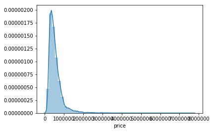


```python
print("Skewness: %f" % df['price'].skew())
#峰度高就意味著方差增大是由低頻度的大於或小於平均值的極端差值引起的。
print("Kurtosis: %f" % df['price'].kurt())
#当数据变得更加对称时，它的偏度值会更接近零。
```

    Skewness: 4.024069
    Kurtosis: 34.585540
    


```python
corrmat = df.corr()
f, ax = plt.subplots(figsize=(12, 9))
sns.heatmap(corrmat, vmin=-1,vmax=1, square=True);
```


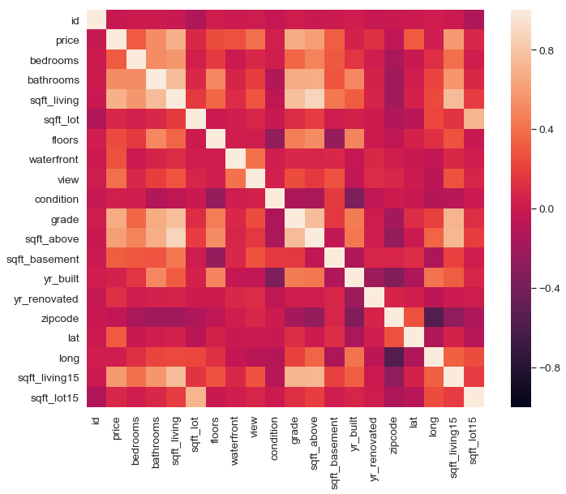


```python
k = 10 #number of variables for heatmap
cols = corrmat.nlargest(k, 'price')['price'].index
cm = np.corrcoef(df[cols].values.T)
sns.set(font_scale=1.25)
hm = sns.heatmap(cm, cbar=True, annot=True, square=True, fmt='.2f', annot_kws={'size': 10}, yticklabels=cols.values, xticklabels=cols.values)
plt.show()
```


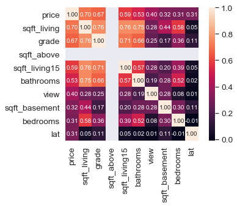


```python
corrmat
```


<div>
<style scoped>
    .dataframe tbody tr th:only-of-type {
        vertical-align: middle;
    }

    .dataframe tbody tr th {
        vertical-align: top;
    }

    .dataframe thead th {
        text-align: right;
    }
</style>
<table border="1" class="dataframe">
  <thead>
    <tr style="text-align: right;">
      <th></th>
      <th>id</th>
      <th>price</th>
      <th>bedrooms</th>
      <th>bathrooms</th>
      <th>sqft_living</th>
      <th>sqft_lot</th>
      <th>floors</th>
      <th>waterfront</th>
      <th>view</th>
      <th>condition</th>
      <th>grade</th>
      <th>sqft_above</th>
      <th>sqft_basement</th>
      <th>yr_built</th>
      <th>yr_renovated</th>
      <th>zipcode</th>
      <th>lat</th>
      <th>long</th>
      <th>sqft_living15</th>
      <th>sqft_lot15</th>
    </tr>
  </thead>
  <tbody>
    <tr>
      <th>id</th>
      <td>1.000000</td>
      <td>-0.016762</td>
      <td>0.001286</td>
      <td>0.005160</td>
      <td>-0.012258</td>
      <td>-0.132109</td>
      <td>0.018525</td>
      <td>-0.002721</td>
      <td>0.011592</td>
      <td>-0.023783</td>
      <td>0.008130</td>
      <td>-0.010830</td>
      <td>-0.005151</td>
      <td>0.021380</td>
      <td>-0.016907</td>
      <td>-0.008224</td>
      <td>-0.001891</td>
      <td>0.020799</td>
      <td>-0.002901</td>
      <td>-0.138798</td>
    </tr>
    <tr>
      <th>price</th>
      <td>-0.016762</td>
      <td>1.000000</td>
      <td>0.308350</td>
      <td>0.525138</td>
      <td>0.702035</td>
      <td>0.089661</td>
      <td>0.256794</td>
      <td>0.266369</td>
      <td>0.397293</td>
      <td>0.036362</td>
      <td>0.667434</td>
      <td>0.605567</td>
      <td>0.323816</td>
      <td>0.054012</td>
      <td>0.126434</td>
      <td>-0.053203</td>
      <td>0.307003</td>
      <td>0.021626</td>
      <td>0.585379</td>
      <td>0.082447</td>
    </tr>
    <tr>
      <th>bedrooms</th>
      <td>0.001286</td>
      <td>0.308350</td>
      <td>1.000000</td>
      <td>0.515884</td>
      <td>0.576671</td>
      <td>0.031703</td>
      <td>0.175429</td>
      <td>-0.006582</td>
      <td>0.079532</td>
      <td>0.028472</td>
      <td>0.356967</td>
      <td>0.477616</td>
      <td>0.303093</td>
      <td>0.154178</td>
      <td>0.018841</td>
      <td>-0.152668</td>
      <td>-0.008931</td>
      <td>0.129473</td>
      <td>0.391638</td>
      <td>0.029244</td>
    </tr>
    <tr>
      <th>bathrooms</th>
      <td>0.005160</td>
      <td>0.525138</td>
      <td>0.515884</td>
      <td>1.000000</td>
      <td>0.754665</td>
      <td>0.087740</td>
      <td>0.500653</td>
      <td>0.063744</td>
      <td>0.187737</td>
      <td>-0.124982</td>
      <td>0.664983</td>
      <td>0.685363</td>
      <td>0.283770</td>
      <td>0.506019</td>
      <td>0.050739</td>
      <td>-0.203866</td>
      <td>0.024573</td>
      <td>0.223042</td>
      <td>0.568634</td>
      <td>0.087175</td>
    </tr>
    <tr>
      <th>sqft_living</th>
      <td>-0.012258</td>
      <td>0.702035</td>
      <td>0.576671</td>
      <td>0.754665</td>
      <td>1.000000</td>
      <td>0.172826</td>
      <td>0.353949</td>
      <td>0.103818</td>
      <td>0.284611</td>
      <td>-0.058753</td>
      <td>0.762704</td>
      <td>0.876644</td>
      <td>0.435043</td>
      <td>0.318049</td>
      <td>0.055363</td>
      <td>-0.199430</td>
      <td>0.052529</td>
      <td>0.240223</td>
      <td>0.756420</td>
      <td>0.183286</td>
    </tr>
    <tr>
      <th>sqft_lot</th>
      <td>-0.132109</td>
      <td>0.089661</td>
      <td>0.031703</td>
      <td>0.087740</td>
      <td>0.172826</td>
      <td>1.000000</td>
      <td>-0.005201</td>
      <td>0.021604</td>
      <td>0.074710</td>
      <td>-0.008958</td>
      <td>0.113621</td>
      <td>0.183511</td>
      <td>0.015286</td>
      <td>0.053080</td>
      <td>0.007644</td>
      <td>-0.129574</td>
      <td>-0.085683</td>
      <td>0.229521</td>
      <td>0.144608</td>
      <td>0.718557</td>
    </tr>
    <tr>
      <th>floors</th>
      <td>0.018525</td>
      <td>0.256794</td>
      <td>0.175429</td>
      <td>0.500653</td>
      <td>0.353949</td>
      <td>-0.005201</td>
      <td>1.000000</td>
      <td>0.023698</td>
      <td>0.029444</td>
      <td>-0.263768</td>
      <td>0.458183</td>
      <td>0.523899</td>
      <td>-0.245705</td>
      <td>0.489319</td>
      <td>0.006338</td>
      <td>-0.059121</td>
      <td>0.049614</td>
      <td>0.125419</td>
      <td>0.279885</td>
      <td>-0.011269</td>
    </tr>
    <tr>
      <th>waterfront</th>
      <td>-0.002721</td>
      <td>0.266369</td>
      <td>-0.006582</td>
      <td>0.063744</td>
      <td>0.103818</td>
      <td>0.021604</td>
      <td>0.023698</td>
      <td>1.000000</td>
      <td>0.401857</td>
      <td>0.016653</td>
      <td>0.082775</td>
      <td>0.072074</td>
      <td>0.080588</td>
      <td>-0.026161</td>
      <td>0.092885</td>
      <td>0.030285</td>
      <td>-0.014274</td>
      <td>-0.041910</td>
      <td>0.086463</td>
      <td>0.030703</td>
    </tr>
    <tr>
      <th>view</th>
      <td>0.011592</td>
      <td>0.397293</td>
      <td>0.079532</td>
      <td>0.187737</td>
      <td>0.284611</td>
      <td>0.074710</td>
      <td>0.029444</td>
      <td>0.401857</td>
      <td>1.000000</td>
      <td>0.045990</td>
      <td>0.251321</td>
      <td>0.167648</td>
      <td>0.276947</td>
      <td>-0.053440</td>
      <td>0.103917</td>
      <td>0.084827</td>
      <td>0.006157</td>
      <td>-0.078400</td>
      <td>0.280439</td>
      <td>0.072575</td>
    </tr>
    <tr>
      <th>condition</th>
      <td>-0.023783</td>
      <td>0.036362</td>
      <td>0.028472</td>
      <td>-0.124982</td>
      <td>-0.058753</td>
      <td>-0.008958</td>
      <td>-0.263768</td>
      <td>0.016653</td>
      <td>0.045990</td>
      <td>1.000000</td>
      <td>-0.144674</td>
      <td>-0.158206</td>
      <td>0.174105</td>
      <td>-0.361417</td>
      <td>-0.060618</td>
      <td>0.003026</td>
      <td>-0.014941</td>
      <td>-0.106500</td>
      <td>-0.092824</td>
      <td>-0.003406</td>
    </tr>
    <tr>
      <th>grade</th>
      <td>0.008130</td>
      <td>0.667434</td>
      <td>0.356967</td>
      <td>0.664983</td>
      <td>0.762704</td>
      <td>0.113621</td>
      <td>0.458183</td>
      <td>0.082775</td>
      <td>0.251321</td>
      <td>-0.144674</td>
      <td>1.000000</td>
      <td>0.755924</td>
      <td>0.168392</td>
      <td>0.446963</td>
      <td>0.014414</td>
      <td>-0.184862</td>
      <td>0.114084</td>
      <td>0.198372</td>
      <td>0.713202</td>
      <td>0.119248</td>
    </tr>
    <tr>
      <th>sqft_above</th>
      <td>-0.010830</td>
      <td>0.605567</td>
      <td>0.477616</td>
      <td>0.685363</td>
      <td>0.876644</td>
      <td>0.183511</td>
      <td>0.523899</td>
      <td>0.072074</td>
      <td>0.167648</td>
      <td>-0.158206</td>
      <td>0.755924</td>
      <td>1.000000</td>
      <td>-0.051976</td>
      <td>0.423915</td>
      <td>0.023283</td>
      <td>-0.261192</td>
      <td>-0.000810</td>
      <td>0.343800</td>
      <td>0.731871</td>
      <td>0.194048</td>
    </tr>
    <tr>
      <th>sqft_basement</th>
      <td>-0.005151</td>
      <td>0.323816</td>
      <td>0.303093</td>
      <td>0.283770</td>
      <td>0.435043</td>
      <td>0.015286</td>
      <td>-0.245705</td>
      <td>0.080588</td>
      <td>0.276947</td>
      <td>0.174105</td>
      <td>0.168392</td>
      <td>-0.051976</td>
      <td>1.000000</td>
      <td>-0.133124</td>
      <td>0.071323</td>
      <td>0.074845</td>
      <td>0.110538</td>
      <td>-0.144765</td>
      <td>0.200355</td>
      <td>0.017276</td>
    </tr>
    <tr>
      <th>yr_built</th>
      <td>0.021380</td>
      <td>0.054012</td>
      <td>0.154178</td>
      <td>0.506019</td>
      <td>0.318049</td>
      <td>0.053080</td>
      <td>0.489319</td>
      <td>-0.026161</td>
      <td>-0.053440</td>
      <td>-0.361417</td>
      <td>0.446963</td>
      <td>0.423915</td>
      <td>-0.133124</td>
      <td>1.000000</td>
      <td>-0.224874</td>
      <td>-0.346869</td>
      <td>-0.148122</td>
      <td>0.409356</td>
      <td>0.326229</td>
      <td>0.070958</td>
    </tr>
    <tr>
      <th>yr_renovated</th>
      <td>-0.016907</td>
      <td>0.126434</td>
      <td>0.018841</td>
      <td>0.050739</td>
      <td>0.055363</td>
      <td>0.007644</td>
      <td>0.006338</td>
      <td>0.092885</td>
      <td>0.103917</td>
      <td>-0.060618</td>
      <td>0.014414</td>
      <td>0.023283</td>
      <td>0.071323</td>
      <td>-0.224874</td>
      <td>1.000000</td>
      <td>0.064357</td>
      <td>0.029398</td>
      <td>-0.068372</td>
      <td>-0.002673</td>
      <td>0.007854</td>
    </tr>
    <tr>
      <th>zipcode</th>
      <td>-0.008224</td>
      <td>-0.053203</td>
      <td>-0.152668</td>
      <td>-0.203866</td>
      <td>-0.199430</td>
      <td>-0.129574</td>
      <td>-0.059121</td>
      <td>0.030285</td>
      <td>0.084827</td>
      <td>0.003026</td>
      <td>-0.184862</td>
      <td>-0.261192</td>
      <td>0.074845</td>
      <td>-0.346869</td>
      <td>0.064357</td>
      <td>1.000000</td>
      <td>0.267048</td>
      <td>-0.564072</td>
      <td>-0.279033</td>
      <td>-0.147221</td>
    </tr>
    <tr>
      <th>lat</th>
      <td>-0.001891</td>
      <td>0.307003</td>
      <td>-0.008931</td>
      <td>0.024573</td>
      <td>0.052529</td>
      <td>-0.085683</td>
      <td>0.049614</td>
      <td>-0.014274</td>
      <td>0.006157</td>
      <td>-0.014941</td>
      <td>0.114084</td>
      <td>-0.000810</td>
      <td>0.110538</td>
      <td>-0.148122</td>
      <td>0.029398</td>
      <td>0.267048</td>
      <td>1.000000</td>
      <td>-0.135512</td>
      <td>0.048858</td>
      <td>-0.086419</td>
    </tr>
    <tr>
      <th>long</th>
      <td>0.020799</td>
      <td>0.021626</td>
      <td>0.129473</td>
      <td>0.223042</td>
      <td>0.240223</td>
      <td>0.229521</td>
      <td>0.125419</td>
      <td>-0.041910</td>
      <td>-0.078400</td>
      <td>-0.106500</td>
      <td>0.198372</td>
      <td>0.343800</td>
      <td>-0.144765</td>
      <td>0.409356</td>
      <td>-0.068372</td>
      <td>-0.564072</td>
      <td>-0.135512</td>
      <td>1.000000</td>
      <td>0.334605</td>
      <td>0.254451</td>
    </tr>
    <tr>
      <th>sqft_living15</th>
      <td>-0.002901</td>
      <td>0.585379</td>
      <td>0.391638</td>
      <td>0.568634</td>
      <td>0.756420</td>
      <td>0.144608</td>
      <td>0.279885</td>
      <td>0.086463</td>
      <td>0.280439</td>
      <td>-0.092824</td>
      <td>0.713202</td>
      <td>0.731871</td>
      <td>0.200355</td>
      <td>0.326229</td>
      <td>-0.002673</td>
      <td>-0.279033</td>
      <td>0.048858</td>
      <td>0.334605</td>
      <td>1.000000</td>
      <td>0.183192</td>
    </tr>
    <tr>
      <th>sqft_lot15</th>
      <td>-0.138798</td>
      <td>0.082447</td>
      <td>0.029244</td>
      <td>0.087175</td>
      <td>0.183286</td>
      <td>0.718557</td>
      <td>-0.011269</td>
      <td>0.030703</td>
      <td>0.072575</td>
      <td>-0.003406</td>
      <td>0.119248</td>
      <td>0.194048</td>
      <td>0.017276</td>
      <td>0.070958</td>
      <td>0.007854</td>
      <td>-0.147221</td>
      <td>-0.086419</td>
      <td>0.254451</td>
      <td>0.183192</td>
      <td>1.000000</td>
    </tr>
  </tbody>
</table>
</div>


```python
- price 和 sqft_living(平方英尺) 和 grade 和 sqft_above 有相關性
- 此外sqft_living和bathroom也呈現相關性很高
- sqft_living 和 sqft_above也是
```


```python
sns.set()
cols = ['price', 'sqft_living', 'grade', 'sqft_above', 'sqft_living15']
sns.pairplot(df[cols], size = 2.5)
plt.show();
```


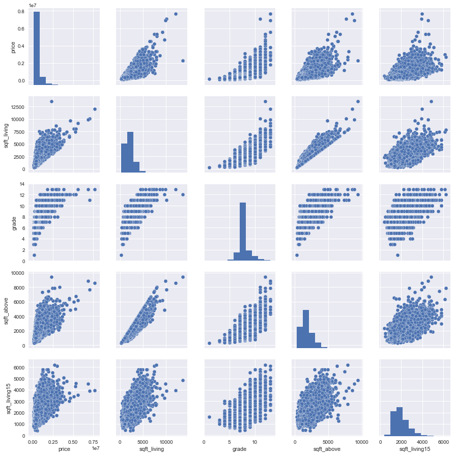


```python
total = df.isnull().sum().sort_values(ascending=False)
percent = (df.isnull().sum()/df.isnull().count()).sort_values(ascending=False)
missing_data = pd.concat([total, percent], axis=1, keys=['Total', 'Percent'])
missing_data.head(20)
```


<div>
<style scoped>
    .dataframe tbody tr th:only-of-type {
        vertical-align: middle;
    }

    .dataframe tbody tr th {
        vertical-align: top;
    }

    .dataframe thead th {
        text-align: right;
    }
</style>
<table border="1" class="dataframe">
  <thead>
    <tr style="text-align: right;">
      <th></th>
      <th>Total</th>
      <th>Percent</th>
    </tr>
  </thead>
  <tbody>
    <tr>
      <th>sqft_lot15</th>
      <td>0</td>
      <td>0.0</td>
    </tr>
    <tr>
      <th>view</th>
      <td>0</td>
      <td>0.0</td>
    </tr>
    <tr>
      <th>date</th>
      <td>0</td>
      <td>0.0</td>
    </tr>
    <tr>
      <th>price</th>
      <td>0</td>
      <td>0.0</td>
    </tr>
    <tr>
      <th>bedrooms</th>
      <td>0</td>
      <td>0.0</td>
    </tr>
    <tr>
      <th>bathrooms</th>
      <td>0</td>
      <td>0.0</td>
    </tr>
    <tr>
      <th>sqft_living</th>
      <td>0</td>
      <td>0.0</td>
    </tr>
    <tr>
      <th>sqft_lot</th>
      <td>0</td>
      <td>0.0</td>
    </tr>
    <tr>
      <th>floors</th>
      <td>0</td>
      <td>0.0</td>
    </tr>
    <tr>
      <th>waterfront</th>
      <td>0</td>
      <td>0.0</td>
    </tr>
    <tr>
      <th>condition</th>
      <td>0</td>
      <td>0.0</td>
    </tr>
    <tr>
      <th>sqft_living15</th>
      <td>0</td>
      <td>0.0</td>
    </tr>
    <tr>
      <th>grade</th>
      <td>0</td>
      <td>0.0</td>
    </tr>
    <tr>
      <th>sqft_above</th>
      <td>0</td>
      <td>0.0</td>
    </tr>
    <tr>
      <th>sqft_basement</th>
      <td>0</td>
      <td>0.0</td>
    </tr>
    <tr>
      <th>yr_built</th>
      <td>0</td>
      <td>0.0</td>
    </tr>
    <tr>
      <th>yr_renovated</th>
      <td>0</td>
      <td>0.0</td>
    </tr>
    <tr>
      <th>zipcode</th>
      <td>0</td>
      <td>0.0</td>
    </tr>
    <tr>
      <th>lat</th>
      <td>0</td>
      <td>0.0</td>
    </tr>
    <tr>
      <th>long</th>
      <td>0</td>
      <td>0.0</td>
    </tr>
  </tbody>
</table>
</div>


```python
from sklearn.preprocessing import StandardScaler
saleprice_scaled = StandardScaler().fit_transform(df['price'][:,np.newaxis]);
low_range = saleprice_scaled[saleprice_scaled[:,0].argsort()][:10]
high_range= saleprice_scaled[saleprice_scaled[:,0].argsort()][-10:]
print('outer range (low) of the distribution:')
print(low_range)
print('\nouter range (high) of the distribution:')
print(high_range)
```

    outer range (low) of the distribution:
    [[-1.26686039]
     [-1.25868864]
     [-1.25324081]
     [-1.2505169 ]
     [-1.24779298]
     [-1.24643103]
     [-1.24506907]
     [-1.24234515]
     [-1.23962124]
     [-1.23962124]]
    
    outer range (high) of the distribution:
    [[10.75649871]
     [10.78646177]
     [11.24407943]
     [12.45022882]
     [12.96559346]
     [13.10178919]
     [13.70105041]
     [17.28299812]
     [17.76649297]
     [19.50298853]]
    


```python
var = 'sqft_living'
data = pd.concat([df['price'], df[var]], axis=1)
data.plot.scatter(x=var, y='price', ylim=(0,7700000));
```


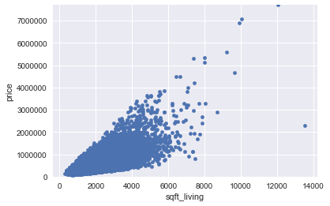


```python
from scipy.stats import norm
from scipy import stats
sns.distplot(df['price'], fit = norm);
fig = plt.figure()
res = stats.probplot(df['price'], plot=plt)
```

    /anaconda3/lib/python3.6/site-packages/scipy/stats/stats.py:1706: FutureWarning: Using a non-tuple sequence for multidimensional indexing is deprecated; use `arr[tuple(seq)]` instead of `arr[seq]`. In the future this will be interpreted as an array index, `arr[np.array(seq)]`, which will result either in an error or a different result.
      return np.add.reduce(sorted[indexer] * weights, axis=axis) / sumval
    


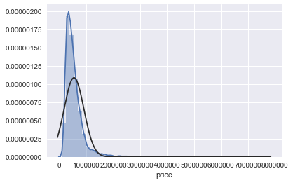


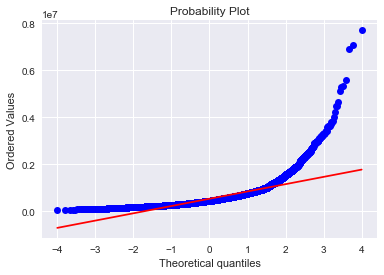


```python
df['price'] = np.log(df['price'])
```


```python
sns.distplot(df['price'], fit=norm);
fig = plt.figure()
res = stats.probplot(df['price'], plot=plt)
```

    /anaconda3/lib/python3.6/site-packages/scipy/stats/stats.py:1706: FutureWarning: Using a non-tuple sequence for multidimensional indexing is deprecated; use `arr[tuple(seq)]` instead of `arr[seq]`. In the future this will be interpreted as an array index, `arr[np.array(seq)]`, which will result either in an error or a different result.
      return np.add.reduce(sorted[indexer] * weights, axis=axis) / sumval
    


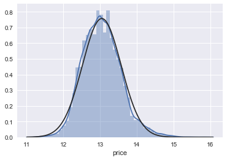


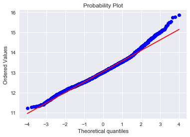


```python
sns.distplot(df['sqft_living'], fit=norm);
fig = plt.figure()
res = stats.probplot(df['sqft_living'], plot=plt)
```

    /anaconda3/lib/python3.6/site-packages/scipy/stats/stats.py:1706: FutureWarning: Using a non-tuple sequence for multidimensional indexing is deprecated; use `arr[tuple(seq)]` instead of `arr[seq]`. In the future this will be interpreted as an array index, `arr[np.array(seq)]`, which will result either in an error or a different result.
      return np.add.reduce(sorted[indexer] * weights, axis=axis) / sumval
    


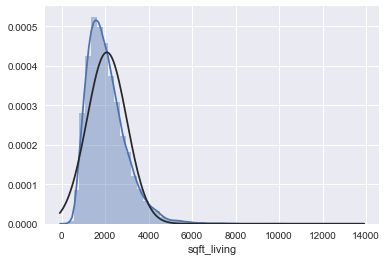


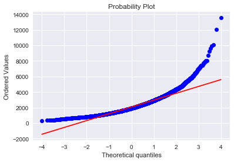


```python
df['sqft_living'] = np.log(df['sqft_living'])
```


```python
sns.distplot(df['sqft_living'], fit=norm);
fig = plt.figure()
res = stats.probplot(df['sqft_living'], plot=plt)
```

    /anaconda3/lib/python3.6/site-packages/scipy/stats/stats.py:1706: FutureWarning: Using a non-tuple sequence for multidimensional indexing is deprecated; use `arr[tuple(seq)]` instead of `arr[seq]`. In the future this will be interpreted as an array index, `arr[np.array(seq)]`, which will result either in an error or a different result.
      return np.add.reduce(sorted[indexer] * weights, axis=axis) / sumval
    


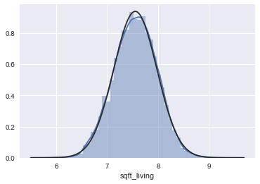


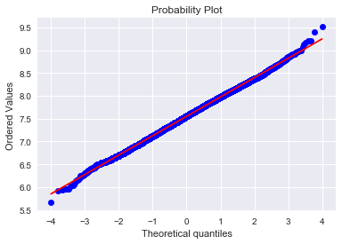


```python
sns.distplot(df['sqft_above'], fit=norm);
fig = plt.figure()
res = stats.probplot(df['sqft_above'], plot=plt)
```

    /anaconda3/lib/python3.6/site-packages/scipy/stats/stats.py:1706: FutureWarning: Using a non-tuple sequence for multidimensional indexing is deprecated; use `arr[tuple(seq)]` instead of `arr[seq]`. In the future this will be interpreted as an array index, `arr[np.array(seq)]`, which will result either in an error or a different result.
      return np.add.reduce(sorted[indexer] * weights, axis=axis) / sumval
    


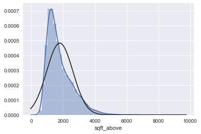


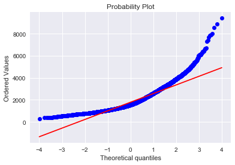


```python
plt.scatter(df['sqft_living'], df['price']);
```


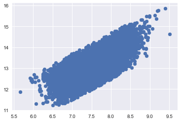


```python
df= pd.get_dummies(df)
```


```python
df
```


<div>
<style scoped>
    .dataframe tbody tr th:only-of-type {
        vertical-align: middle;
    }

    .dataframe tbody tr th {
        vertical-align: top;
    }

    .dataframe thead th {
        text-align: right;
    }
</style>
<table border="1" class="dataframe">
  <thead>
    <tr style="text-align: right;">
      <th></th>
      <th>id</th>
      <th>price</th>
      <th>bedrooms</th>
      <th>bathrooms</th>
      <th>sqft_living</th>
      <th>sqft_lot</th>
      <th>floors</th>
      <th>waterfront</th>
      <th>view</th>
      <th>condition</th>
      <th>...</th>
      <th>date_20150508T000000</th>
      <th>date_20150509T000000</th>
      <th>date_20150510T000000</th>
      <th>date_20150511T000000</th>
      <th>date_20150512T000000</th>
      <th>date_20150513T000000</th>
      <th>date_20150514T000000</th>
      <th>date_20150515T000000</th>
      <th>date_20150524T000000</th>
      <th>date_20150527T000000</th>
    </tr>
  </thead>
  <tbody>
    <tr>
      <th>0</th>
      <td>7129300520</td>
      <td>12.309982</td>
      <td>3</td>
      <td>1.00</td>
      <td>7.073270</td>
      <td>5650</td>
      <td>1.0</td>
      <td>0</td>
      <td>0</td>
      <td>3</td>
      <td>...</td>
      <td>0</td>
      <td>0</td>
      <td>0</td>
      <td>0</td>
      <td>0</td>
      <td>0</td>
      <td>0</td>
      <td>0</td>
      <td>0</td>
      <td>0</td>
    </tr>
    <tr>
      <th>1</th>
      <td>6414100192</td>
      <td>13.195614</td>
      <td>3</td>
      <td>2.25</td>
      <td>7.851661</td>
      <td>7242</td>
      <td>2.0</td>
      <td>0</td>
      <td>0</td>
      <td>3</td>
      <td>...</td>
      <td>0</td>
      <td>0</td>
      <td>0</td>
      <td>0</td>
      <td>0</td>
      <td>0</td>
      <td>0</td>
      <td>0</td>
      <td>0</td>
      <td>0</td>
    </tr>
    <tr>
      <th>2</th>
      <td>5631500400</td>
      <td>12.100712</td>
      <td>2</td>
      <td>1.00</td>
      <td>6.646391</td>
      <td>10000</td>
      <td>1.0</td>
      <td>0</td>
      <td>0</td>
      <td>3</td>
      <td>...</td>
      <td>0</td>
      <td>0</td>
      <td>0</td>
      <td>0</td>
      <td>0</td>
      <td>0</td>
      <td>0</td>
      <td>0</td>
      <td>0</td>
      <td>0</td>
    </tr>
    <tr>
      <th>3</th>
      <td>2487200875</td>
      <td>13.311329</td>
      <td>4</td>
      <td>3.00</td>
      <td>7.580700</td>
      <td>5000</td>
      <td>1.0</td>
      <td>0</td>
      <td>0</td>
      <td>5</td>
      <td>...</td>
      <td>0</td>
      <td>0</td>
      <td>0</td>
      <td>0</td>
      <td>0</td>
      <td>0</td>
      <td>0</td>
      <td>0</td>
      <td>0</td>
      <td>0</td>
    </tr>
    <tr>
      <th>4</th>
      <td>1954400510</td>
      <td>13.142166</td>
      <td>3</td>
      <td>2.00</td>
      <td>7.426549</td>
      <td>8080</td>
      <td>1.0</td>
      <td>0</td>
      <td>0</td>
      <td>3</td>
      <td>...</td>
      <td>0</td>
      <td>0</td>
      <td>0</td>
      <td>0</td>
      <td>0</td>
      <td>0</td>
      <td>0</td>
      <td>0</td>
      <td>0</td>
      <td>0</td>
    </tr>
    <tr>
      <th>5</th>
      <td>7237550310</td>
      <td>14.018451</td>
      <td>4</td>
      <td>4.50</td>
      <td>8.597851</td>
      <td>101930</td>
      <td>1.0</td>
      <td>0</td>
      <td>0</td>
      <td>3</td>
      <td>...</td>
      <td>0</td>
      <td>0</td>
      <td>0</td>
      <td>0</td>
      <td>0</td>
      <td>0</td>
      <td>0</td>
      <td>0</td>
      <td>0</td>
      <td>0</td>
    </tr>
    <tr>
      <th>6</th>
      <td>1321400060</td>
      <td>12.458775</td>
      <td>3</td>
      <td>2.25</td>
      <td>7.447168</td>
      <td>6819</td>
      <td>2.0</td>
      <td>0</td>
      <td>0</td>
      <td>3</td>
      <td>...</td>
      <td>0</td>
      <td>0</td>
      <td>0</td>
      <td>0</td>
      <td>0</td>
      <td>0</td>
      <td>0</td>
      <td>0</td>
      <td>0</td>
      <td>0</td>
    </tr>
    <tr>
      <th>7</th>
      <td>2008000270</td>
      <td>12.583995</td>
      <td>3</td>
      <td>1.50</td>
      <td>6.966024</td>
      <td>9711</td>
      <td>1.0</td>
      <td>0</td>
      <td>0</td>
      <td>3</td>
      <td>...</td>
      <td>0</td>
      <td>0</td>
      <td>0</td>
      <td>0</td>
      <td>0</td>
      <td>0</td>
      <td>0</td>
      <td>0</td>
      <td>0</td>
      <td>0</td>
    </tr>
    <tr>
      <th>8</th>
      <td>2414600126</td>
      <td>12.343658</td>
      <td>3</td>
      <td>1.00</td>
      <td>7.484369</td>
      <td>7470</td>
      <td>1.0</td>
      <td>0</td>
      <td>0</td>
      <td>3</td>
      <td>...</td>
      <td>0</td>
      <td>0</td>
      <td>0</td>
      <td>0</td>
      <td>0</td>
      <td>0</td>
      <td>0</td>
      <td>0</td>
      <td>0</td>
      <td>0</td>
    </tr>
    <tr>
      <th>9</th>
      <td>3793500160</td>
      <td>12.685408</td>
      <td>3</td>
      <td>2.50</td>
      <td>7.544332</td>
      <td>6560</td>
      <td>2.0</td>
      <td>0</td>
      <td>0</td>
      <td>3</td>
      <td>...</td>
      <td>0</td>
      <td>0</td>
      <td>0</td>
      <td>0</td>
      <td>0</td>
      <td>0</td>
      <td>0</td>
      <td>0</td>
      <td>0</td>
      <td>0</td>
    </tr>
    <tr>
      <th>10</th>
      <td>1736800520</td>
      <td>13.403776</td>
      <td>3</td>
      <td>2.50</td>
      <td>8.177516</td>
      <td>9796</td>
      <td>1.0</td>
      <td>0</td>
      <td>0</td>
      <td>3</td>
      <td>...</td>
      <td>0</td>
      <td>0</td>
      <td>0</td>
      <td>0</td>
      <td>0</td>
      <td>0</td>
      <td>0</td>
      <td>0</td>
      <td>0</td>
      <td>0</td>
    </tr>
    <tr>
      <th>11</th>
      <td>9212900260</td>
      <td>13.056224</td>
      <td>2</td>
      <td>1.00</td>
      <td>7.056175</td>
      <td>6000</td>
      <td>1.0</td>
      <td>0</td>
      <td>0</td>
      <td>4</td>
      <td>...</td>
      <td>0</td>
      <td>0</td>
      <td>0</td>
      <td>0</td>
      <td>0</td>
      <td>0</td>
      <td>0</td>
      <td>0</td>
      <td>0</td>
      <td>0</td>
    </tr>
    <tr>
      <th>12</th>
      <td>114101516</td>
      <td>12.644328</td>
      <td>3</td>
      <td>1.00</td>
      <td>7.265430</td>
      <td>19901</td>
      <td>1.5</td>
      <td>0</td>
      <td>0</td>
      <td>4</td>
      <td>...</td>
      <td>0</td>
      <td>0</td>
      <td>0</td>
      <td>0</td>
      <td>0</td>
      <td>0</td>
      <td>0</td>
      <td>0</td>
      <td>0</td>
      <td>0</td>
    </tr>
    <tr>
      <th>13</th>
      <td>6054650070</td>
      <td>12.899220</td>
      <td>3</td>
      <td>1.75</td>
      <td>7.222566</td>
      <td>9680</td>
      <td>1.0</td>
      <td>0</td>
      <td>0</td>
      <td>4</td>
      <td>...</td>
      <td>0</td>
      <td>0</td>
      <td>0</td>
      <td>0</td>
      <td>0</td>
      <td>0</td>
      <td>0</td>
      <td>0</td>
      <td>0</td>
      <td>0</td>
    </tr>
    <tr>
      <th>14</th>
      <td>1175000570</td>
      <td>13.180632</td>
      <td>5</td>
      <td>2.00</td>
      <td>7.501082</td>
      <td>4850</td>
      <td>1.5</td>
      <td>0</td>
      <td>0</td>
      <td>3</td>
      <td>...</td>
      <td>0</td>
      <td>0</td>
      <td>0</td>
      <td>0</td>
      <td>0</td>
      <td>0</td>
      <td>0</td>
      <td>0</td>
      <td>0</td>
      <td>0</td>
    </tr>
    <tr>
      <th>15</th>
      <td>9297300055</td>
      <td>13.384728</td>
      <td>4</td>
      <td>3.00</td>
      <td>7.989560</td>
      <td>5000</td>
      <td>2.0</td>
      <td>0</td>
      <td>3</td>
      <td>3</td>
      <td>...</td>
      <td>0</td>
      <td>0</td>
      <td>0</td>
      <td>0</td>
      <td>0</td>
      <td>0</td>
      <td>0</td>
      <td>0</td>
      <td>0</td>
      <td>0</td>
    </tr>
    <tr>
      <th>16</th>
      <td>1875500060</td>
      <td>12.886641</td>
      <td>3</td>
      <td>2.00</td>
      <td>7.544332</td>
      <td>14040</td>
      <td>2.0</td>
      <td>0</td>
      <td>0</td>
      <td>3</td>
      <td>...</td>
      <td>0</td>
      <td>0</td>
      <td>0</td>
      <td>0</td>
      <td>0</td>
      <td>0</td>
      <td>0</td>
      <td>0</td>
      <td>0</td>
      <td>0</td>
    </tr>
    <tr>
      <th>17</th>
      <td>6865200140</td>
      <td>13.091904</td>
      <td>4</td>
      <td>1.00</td>
      <td>7.377759</td>
      <td>4300</td>
      <td>1.5</td>
      <td>0</td>
      <td>0</td>
      <td>4</td>
      <td>...</td>
      <td>0</td>
      <td>0</td>
      <td>0</td>
      <td>0</td>
      <td>0</td>
      <td>0</td>
      <td>0</td>
      <td>0</td>
      <td>0</td>
      <td>0</td>
    </tr>
    <tr>
      <th>18</th>
      <td>16000397</td>
      <td>12.149502</td>
      <td>2</td>
      <td>1.00</td>
      <td>7.090077</td>
      <td>9850</td>
      <td>1.0</td>
      <td>0</td>
      <td>0</td>
      <td>4</td>
      <td>...</td>
      <td>0</td>
      <td>0</td>
      <td>0</td>
      <td>0</td>
      <td>0</td>
      <td>0</td>
      <td>0</td>
      <td>0</td>
      <td>0</td>
      <td>0</td>
    </tr>
    <tr>
      <th>19</th>
      <td>7983200060</td>
      <td>12.345835</td>
      <td>3</td>
      <td>1.00</td>
      <td>7.130899</td>
      <td>9774</td>
      <td>1.0</td>
      <td>0</td>
      <td>0</td>
      <td>4</td>
      <td>...</td>
      <td>0</td>
      <td>0</td>
      <td>0</td>
      <td>0</td>
      <td>0</td>
      <td>0</td>
      <td>0</td>
      <td>0</td>
      <td>0</td>
      <td>0</td>
    </tr>
    <tr>
      <th>20</th>
      <td>6300500875</td>
      <td>12.860999</td>
      <td>4</td>
      <td>1.75</td>
      <td>7.390181</td>
      <td>4980</td>
      <td>1.0</td>
      <td>0</td>
      <td>0</td>
      <td>4</td>
      <td>...</td>
      <td>0</td>
      <td>0</td>
      <td>0</td>
      <td>0</td>
      <td>0</td>
      <td>0</td>
      <td>0</td>
      <td>0</td>
      <td>0</td>
      <td>0</td>
    </tr>
    <tr>
      <th>21</th>
      <td>2524049179</td>
      <td>14.508658</td>
      <td>3</td>
      <td>2.75</td>
      <td>8.022897</td>
      <td>44867</td>
      <td>1.0</td>
      <td>0</td>
      <td>4</td>
      <td>3</td>
      <td>...</td>
      <td>0</td>
      <td>0</td>
      <td>0</td>
      <td>0</td>
      <td>0</td>
      <td>0</td>
      <td>0</td>
      <td>0</td>
      <td>0</td>
      <td>0</td>
    </tr>
    <tr>
      <th>22</th>
      <td>7137970340</td>
      <td>12.560244</td>
      <td>5</td>
      <td>2.50</td>
      <td>7.727535</td>
      <td>6300</td>
      <td>2.0</td>
      <td>0</td>
      <td>0</td>
      <td>3</td>
      <td>...</td>
      <td>0</td>
      <td>0</td>
      <td>0</td>
      <td>0</td>
      <td>0</td>
      <td>0</td>
      <td>0</td>
      <td>0</td>
      <td>0</td>
      <td>0</td>
    </tr>
    <tr>
      <th>23</th>
      <td>8091400200</td>
      <td>12.439958</td>
      <td>2</td>
      <td>1.50</td>
      <td>6.975414</td>
      <td>9643</td>
      <td>1.0</td>
      <td>0</td>
      <td>0</td>
      <td>3</td>
      <td>...</td>
      <td>0</td>
      <td>0</td>
      <td>0</td>
      <td>0</td>
      <td>0</td>
      <td>0</td>
      <td>0</td>
      <td>0</td>
      <td>0</td>
      <td>0</td>
    </tr>
    <tr>
      <th>24</th>
      <td>3814700200</td>
      <td>12.703813</td>
      <td>3</td>
      <td>2.25</td>
      <td>7.803843</td>
      <td>6500</td>
      <td>2.0</td>
      <td>0</td>
      <td>0</td>
      <td>4</td>
      <td>...</td>
      <td>0</td>
      <td>0</td>
      <td>0</td>
      <td>0</td>
      <td>0</td>
      <td>0</td>
      <td>0</td>
      <td>0</td>
      <td>0</td>
      <td>0</td>
    </tr>
    <tr>
      <th>25</th>
      <td>1202000200</td>
      <td>12.358794</td>
      <td>3</td>
      <td>2.00</td>
      <td>7.444249</td>
      <td>4697</td>
      <td>1.5</td>
      <td>0</td>
      <td>0</td>
      <td>5</td>
      <td>...</td>
      <td>0</td>
      <td>0</td>
      <td>0</td>
      <td>0</td>
      <td>0</td>
      <td>0</td>
      <td>0</td>
      <td>0</td>
      <td>0</td>
      <td>0</td>
    </tr>
    <tr>
      <th>26</th>
      <td>1794500383</td>
      <td>13.750439</td>
      <td>3</td>
      <td>1.75</td>
      <td>7.803843</td>
      <td>2691</td>
      <td>2.0</td>
      <td>0</td>
      <td>0</td>
      <td>3</td>
      <td>...</td>
      <td>0</td>
      <td>0</td>
      <td>0</td>
      <td>0</td>
      <td>0</td>
      <td>0</td>
      <td>0</td>
      <td>0</td>
      <td>0</td>
      <td>0</td>
    </tr>
    <tr>
      <th>27</th>
      <td>3303700376</td>
      <td>13.410545</td>
      <td>3</td>
      <td>1.00</td>
      <td>7.244228</td>
      <td>1581</td>
      <td>1.5</td>
      <td>0</td>
      <td>0</td>
      <td>5</td>
      <td>...</td>
      <td>0</td>
      <td>0</td>
      <td>0</td>
      <td>0</td>
      <td>0</td>
      <td>0</td>
      <td>0</td>
      <td>0</td>
      <td>0</td>
      <td>0</td>
    </tr>
    <tr>
      <th>28</th>
      <td>5101402488</td>
      <td>12.989974</td>
      <td>3</td>
      <td>1.75</td>
      <td>7.326466</td>
      <td>6380</td>
      <td>1.0</td>
      <td>0</td>
      <td>0</td>
      <td>3</td>
      <td>...</td>
      <td>0</td>
      <td>0</td>
      <td>0</td>
      <td>0</td>
      <td>0</td>
      <td>0</td>
      <td>0</td>
      <td>0</td>
      <td>0</td>
      <td>0</td>
    </tr>
    <tr>
      <th>29</th>
      <td>1873100390</td>
      <td>13.485617</td>
      <td>4</td>
      <td>2.50</td>
      <td>7.851661</td>
      <td>7173</td>
      <td>2.0</td>
      <td>0</td>
      <td>0</td>
      <td>3</td>
      <td>...</td>
      <td>0</td>
      <td>0</td>
      <td>0</td>
      <td>0</td>
      <td>0</td>
      <td>0</td>
      <td>0</td>
      <td>0</td>
      <td>0</td>
      <td>0</td>
    </tr>
    <tr>
      <th>...</th>
      <td>...</td>
      <td>...</td>
      <td>...</td>
      <td>...</td>
      <td>...</td>
      <td>...</td>
      <td>...</td>
      <td>...</td>
      <td>...</td>
      <td>...</td>
      <td>...</td>
      <td>...</td>
      <td>...</td>
      <td>...</td>
      <td>...</td>
      <td>...</td>
      <td>...</td>
      <td>...</td>
      <td>...</td>
      <td>...</td>
      <td>...</td>
    </tr>
    <tr>
      <th>21583</th>
      <td>2025049203</td>
      <td>12.899095</td>
      <td>2</td>
      <td>1.00</td>
      <td>6.565265</td>
      <td>1157</td>
      <td>2.0</td>
      <td>0</td>
      <td>0</td>
      <td>4</td>
      <td>...</td>
      <td>0</td>
      <td>0</td>
      <td>0</td>
      <td>0</td>
      <td>0</td>
      <td>0</td>
      <td>0</td>
      <td>0</td>
      <td>0</td>
      <td>0</td>
    </tr>
    <tr>
      <th>21584</th>
      <td>952006823</td>
      <td>12.847927</td>
      <td>3</td>
      <td>2.50</td>
      <td>7.138867</td>
      <td>900</td>
      <td>2.0</td>
      <td>0</td>
      <td>0</td>
      <td>3</td>
      <td>...</td>
      <td>0</td>
      <td>0</td>
      <td>0</td>
      <td>0</td>
      <td>0</td>
      <td>0</td>
      <td>0</td>
      <td>0</td>
      <td>0</td>
      <td>0</td>
    </tr>
    <tr>
      <th>21585</th>
      <td>3832050760</td>
      <td>12.506177</td>
      <td>3</td>
      <td>2.50</td>
      <td>7.533694</td>
      <td>5000</td>
      <td>2.0</td>
      <td>0</td>
      <td>0</td>
      <td>3</td>
      <td>...</td>
      <td>0</td>
      <td>0</td>
      <td>0</td>
      <td>0</td>
      <td>0</td>
      <td>0</td>
      <td>0</td>
      <td>0</td>
      <td>0</td>
      <td>0</td>
    </tr>
    <tr>
      <th>21586</th>
      <td>2767604724</td>
      <td>13.132314</td>
      <td>2</td>
      <td>2.50</td>
      <td>7.265430</td>
      <td>1201</td>
      <td>3.0</td>
      <td>0</td>
      <td>0</td>
      <td>3</td>
      <td>...</td>
      <td>0</td>
      <td>0</td>
      <td>0</td>
      <td>0</td>
      <td>0</td>
      <td>0</td>
      <td>0</td>
      <td>0</td>
      <td>0</td>
      <td>0</td>
    </tr>
    <tr>
      <th>21587</th>
      <td>6632300207</td>
      <td>12.860999</td>
      <td>3</td>
      <td>2.50</td>
      <td>7.326466</td>
      <td>1488</td>
      <td>3.0</td>
      <td>0</td>
      <td>0</td>
      <td>3</td>
      <td>...</td>
      <td>0</td>
      <td>0</td>
      <td>0</td>
      <td>0</td>
      <td>0</td>
      <td>0</td>
      <td>0</td>
      <td>0</td>
      <td>0</td>
      <td>0</td>
    </tr>
    <tr>
      <th>21588</th>
      <td>2767600688</td>
      <td>12.934828</td>
      <td>2</td>
      <td>1.50</td>
      <td>7.098376</td>
      <td>1278</td>
      <td>2.0</td>
      <td>0</td>
      <td>0</td>
      <td>3</td>
      <td>...</td>
      <td>0</td>
      <td>0</td>
      <td>0</td>
      <td>0</td>
      <td>0</td>
      <td>0</td>
      <td>0</td>
      <td>0</td>
      <td>0</td>
      <td>0</td>
    </tr>
    <tr>
      <th>21589</th>
      <td>7570050450</td>
      <td>12.758520</td>
      <td>3</td>
      <td>2.50</td>
      <td>7.839919</td>
      <td>4760</td>
      <td>2.0</td>
      <td>0</td>
      <td>0</td>
      <td>3</td>
      <td>...</td>
      <td>0</td>
      <td>0</td>
      <td>0</td>
      <td>0</td>
      <td>0</td>
      <td>0</td>
      <td>0</td>
      <td>0</td>
      <td>0</td>
      <td>0</td>
    </tr>
    <tr>
      <th>21590</th>
      <td>7430200100</td>
      <td>14.016409</td>
      <td>4</td>
      <td>3.50</td>
      <td>8.499029</td>
      <td>9444</td>
      <td>1.5</td>
      <td>0</td>
      <td>0</td>
      <td>3</td>
      <td>...</td>
      <td>0</td>
      <td>0</td>
      <td>0</td>
      <td>0</td>
      <td>0</td>
      <td>0</td>
      <td>0</td>
      <td>0</td>
      <td>0</td>
      <td>0</td>
    </tr>
    <tr>
      <th>21591</th>
      <td>4140940150</td>
      <td>13.256894</td>
      <td>4</td>
      <td>2.75</td>
      <td>7.926603</td>
      <td>3852</td>
      <td>2.0</td>
      <td>0</td>
      <td>0</td>
      <td>3</td>
      <td>...</td>
      <td>0</td>
      <td>0</td>
      <td>0</td>
      <td>0</td>
      <td>0</td>
      <td>0</td>
      <td>0</td>
      <td>0</td>
      <td>0</td>
      <td>0</td>
    </tr>
    <tr>
      <th>21592</th>
      <td>1931300412</td>
      <td>13.071070</td>
      <td>3</td>
      <td>2.25</td>
      <td>7.081709</td>
      <td>1200</td>
      <td>3.0</td>
      <td>0</td>
      <td>0</td>
      <td>3</td>
      <td>...</td>
      <td>0</td>
      <td>0</td>
      <td>0</td>
      <td>0</td>
      <td>0</td>
      <td>0</td>
      <td>0</td>
      <td>0</td>
      <td>0</td>
      <td>0</td>
    </tr>
    <tr>
      <th>21593</th>
      <td>8672200110</td>
      <td>13.899852</td>
      <td>5</td>
      <td>3.75</td>
      <td>8.335671</td>
      <td>8142</td>
      <td>2.0</td>
      <td>0</td>
      <td>2</td>
      <td>3</td>
      <td>...</td>
      <td>0</td>
      <td>0</td>
      <td>0</td>
      <td>0</td>
      <td>0</td>
      <td>0</td>
      <td>0</td>
      <td>0</td>
      <td>0</td>
      <td>0</td>
    </tr>
    <tr>
      <th>21594</th>
      <td>5087900040</td>
      <td>12.765688</td>
      <td>4</td>
      <td>2.75</td>
      <td>7.824046</td>
      <td>5995</td>
      <td>2.0</td>
      <td>0</td>
      <td>0</td>
      <td>3</td>
      <td>...</td>
      <td>0</td>
      <td>0</td>
      <td>0</td>
      <td>0</td>
      <td>0</td>
      <td>0</td>
      <td>0</td>
      <td>0</td>
      <td>0</td>
      <td>0</td>
    </tr>
    <tr>
      <th>21595</th>
      <td>1972201967</td>
      <td>13.161584</td>
      <td>2</td>
      <td>2.25</td>
      <td>7.333023</td>
      <td>981</td>
      <td>3.0</td>
      <td>0</td>
      <td>0</td>
      <td>3</td>
      <td>...</td>
      <td>0</td>
      <td>0</td>
      <td>0</td>
      <td>0</td>
      <td>0</td>
      <td>0</td>
      <td>0</td>
      <td>0</td>
      <td>0</td>
      <td>0</td>
    </tr>
    <tr>
      <th>21596</th>
      <td>7502800100</td>
      <td>13.429775</td>
      <td>5</td>
      <td>2.75</td>
      <td>8.188689</td>
      <td>9437</td>
      <td>2.0</td>
      <td>0</td>
      <td>0</td>
      <td>3</td>
      <td>...</td>
      <td>0</td>
      <td>0</td>
      <td>0</td>
      <td>0</td>
      <td>0</td>
      <td>0</td>
      <td>0</td>
      <td>0</td>
      <td>0</td>
      <td>0</td>
    </tr>
    <tr>
      <th>21597</th>
      <td>191100405</td>
      <td>14.269766</td>
      <td>4</td>
      <td>3.25</td>
      <td>8.134468</td>
      <td>10125</td>
      <td>2.0</td>
      <td>0</td>
      <td>0</td>
      <td>3</td>
      <td>...</td>
      <td>0</td>
      <td>0</td>
      <td>0</td>
      <td>0</td>
      <td>0</td>
      <td>0</td>
      <td>0</td>
      <td>0</td>
      <td>0</td>
      <td>0</td>
    </tr>
    <tr>
      <th>21598</th>
      <td>8956200760</td>
      <td>13.202652</td>
      <td>4</td>
      <td>2.50</td>
      <td>8.044947</td>
      <td>7866</td>
      <td>2.0</td>
      <td>0</td>
      <td>2</td>
      <td>3</td>
      <td>...</td>
      <td>0</td>
      <td>0</td>
      <td>0</td>
      <td>0</td>
      <td>0</td>
      <td>0</td>
      <td>0</td>
      <td>0</td>
      <td>0</td>
      <td>0</td>
    </tr>
    <tr>
      <th>21599</th>
      <td>7202300110</td>
      <td>13.604790</td>
      <td>4</td>
      <td>3.00</td>
      <td>8.291547</td>
      <td>7838</td>
      <td>2.0</td>
      <td>0</td>
      <td>0</td>
      <td>3</td>
      <td>...</td>
      <td>0</td>
      <td>0</td>
      <td>0</td>
      <td>0</td>
      <td>0</td>
      <td>0</td>
      <td>0</td>
      <td>0</td>
      <td>0</td>
      <td>0</td>
    </tr>
    <tr>
      <th>21600</th>
      <td>249000205</td>
      <td>14.245343</td>
      <td>5</td>
      <td>3.75</td>
      <td>8.405144</td>
      <td>8088</td>
      <td>2.0</td>
      <td>0</td>
      <td>0</td>
      <td>3</td>
      <td>...</td>
      <td>0</td>
      <td>0</td>
      <td>0</td>
      <td>0</td>
      <td>0</td>
      <td>0</td>
      <td>0</td>
      <td>0</td>
      <td>0</td>
      <td>0</td>
    </tr>
    <tr>
      <th>21601</th>
      <td>5100403806</td>
      <td>13.054085</td>
      <td>3</td>
      <td>2.50</td>
      <td>7.261927</td>
      <td>1179</td>
      <td>3.0</td>
      <td>0</td>
      <td>0</td>
      <td>3</td>
      <td>...</td>
      <td>0</td>
      <td>0</td>
      <td>0</td>
      <td>0</td>
      <td>0</td>
      <td>0</td>
      <td>0</td>
      <td>0</td>
      <td>0</td>
      <td>0</td>
    </tr>
    <tr>
      <th>21602</th>
      <td>844000965</td>
      <td>12.319401</td>
      <td>3</td>
      <td>1.75</td>
      <td>7.313220</td>
      <td>11968</td>
      <td>1.0</td>
      <td>0</td>
      <td>0</td>
      <td>3</td>
      <td>...</td>
      <td>0</td>
      <td>0</td>
      <td>0</td>
      <td>0</td>
      <td>0</td>
      <td>0</td>
      <td>0</td>
      <td>0</td>
      <td>0</td>
      <td>0</td>
    </tr>
    <tr>
      <th>21603</th>
      <td>7852140040</td>
      <td>13.136759</td>
      <td>3</td>
      <td>2.50</td>
      <td>7.727535</td>
      <td>5536</td>
      <td>2.0</td>
      <td>0</td>
      <td>0</td>
      <td>3</td>
      <td>...</td>
      <td>0</td>
      <td>0</td>
      <td>0</td>
      <td>0</td>
      <td>0</td>
      <td>0</td>
      <td>0</td>
      <td>0</td>
      <td>0</td>
      <td>0</td>
    </tr>
    <tr>
      <th>21604</th>
      <td>9834201367</td>
      <td>12.969212</td>
      <td>3</td>
      <td>2.00</td>
      <td>7.306531</td>
      <td>1126</td>
      <td>3.0</td>
      <td>0</td>
      <td>0</td>
      <td>3</td>
      <td>...</td>
      <td>0</td>
      <td>0</td>
      <td>0</td>
      <td>0</td>
      <td>0</td>
      <td>0</td>
      <td>0</td>
      <td>0</td>
      <td>0</td>
      <td>0</td>
    </tr>
    <tr>
      <th>21605</th>
      <td>3448900210</td>
      <td>13.322337</td>
      <td>4</td>
      <td>2.50</td>
      <td>7.832014</td>
      <td>6023</td>
      <td>2.0</td>
      <td>0</td>
      <td>0</td>
      <td>3</td>
      <td>...</td>
      <td>0</td>
      <td>0</td>
      <td>0</td>
      <td>0</td>
      <td>0</td>
      <td>0</td>
      <td>0</td>
      <td>0</td>
      <td>0</td>
      <td>0</td>
    </tr>
    <tr>
      <th>21606</th>
      <td>7936000429</td>
      <td>13.822983</td>
      <td>4</td>
      <td>3.50</td>
      <td>8.163371</td>
      <td>7200</td>
      <td>2.0</td>
      <td>0</td>
      <td>0</td>
      <td>3</td>
      <td>...</td>
      <td>0</td>
      <td>0</td>
      <td>0</td>
      <td>0</td>
      <td>0</td>
      <td>0</td>
      <td>0</td>
      <td>0</td>
      <td>0</td>
      <td>0</td>
    </tr>
    <tr>
      <th>21607</th>
      <td>2997800021</td>
      <td>13.071070</td>
      <td>3</td>
      <td>2.50</td>
      <td>7.177782</td>
      <td>1294</td>
      <td>2.0</td>
      <td>0</td>
      <td>0</td>
      <td>3</td>
      <td>...</td>
      <td>0</td>
      <td>0</td>
      <td>0</td>
      <td>0</td>
      <td>0</td>
      <td>0</td>
      <td>0</td>
      <td>0</td>
      <td>0</td>
      <td>0</td>
    </tr>
    <tr>
      <th>21608</th>
      <td>263000018</td>
      <td>12.793859</td>
      <td>3</td>
      <td>2.50</td>
      <td>7.333023</td>
      <td>1131</td>
      <td>3.0</td>
      <td>0</td>
      <td>0</td>
      <td>3</td>
      <td>...</td>
      <td>0</td>
      <td>0</td>
      <td>0</td>
      <td>0</td>
      <td>0</td>
      <td>0</td>
      <td>0</td>
      <td>0</td>
      <td>0</td>
      <td>0</td>
    </tr>
    <tr>
      <th>21609</th>
      <td>6600060120</td>
      <td>12.899220</td>
      <td>4</td>
      <td>2.50</td>
      <td>7.745003</td>
      <td>5813</td>
      <td>2.0</td>
      <td>0</td>
      <td>0</td>
      <td>3</td>
      <td>...</td>
      <td>0</td>
      <td>0</td>
      <td>0</td>
      <td>0</td>
      <td>0</td>
      <td>0</td>
      <td>0</td>
      <td>0</td>
      <td>0</td>
      <td>0</td>
    </tr>
    <tr>
      <th>21610</th>
      <td>1523300141</td>
      <td>12.904459</td>
      <td>2</td>
      <td>0.75</td>
      <td>6.927558</td>
      <td>1350</td>
      <td>2.0</td>
      <td>0</td>
      <td>0</td>
      <td>3</td>
      <td>...</td>
      <td>0</td>
      <td>0</td>
      <td>0</td>
      <td>0</td>
      <td>0</td>
      <td>0</td>
      <td>0</td>
      <td>0</td>
      <td>0</td>
      <td>0</td>
    </tr>
    <tr>
      <th>21611</th>
      <td>291310100</td>
      <td>12.899220</td>
      <td>3</td>
      <td>2.50</td>
      <td>7.377759</td>
      <td>2388</td>
      <td>2.0</td>
      <td>0</td>
      <td>0</td>
      <td>3</td>
      <td>...</td>
      <td>0</td>
      <td>0</td>
      <td>0</td>
      <td>0</td>
      <td>0</td>
      <td>0</td>
      <td>0</td>
      <td>0</td>
      <td>0</td>
      <td>0</td>
    </tr>
    <tr>
      <th>21612</th>
      <td>1523300157</td>
      <td>12.691580</td>
      <td>2</td>
      <td>0.75</td>
      <td>6.927558</td>
      <td>1076</td>
      <td>2.0</td>
      <td>0</td>
      <td>0</td>
      <td>3</td>
      <td>...</td>
      <td>0</td>
      <td>0</td>
      <td>0</td>
      <td>0</td>
      <td>0</td>
      <td>0</td>
      <td>0</td>
      <td>0</td>
      <td>0</td>
      <td>0</td>
    </tr>
  </tbody>
</table>
<p>21613 rows × 392 columns</p>
</div>


```python

```
